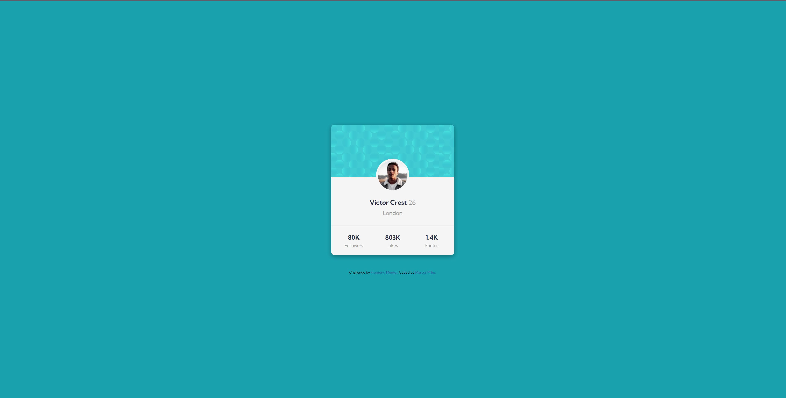

# Frontend Mentor - Profile card component solution

This is a solution to the [Profile card component challenge on Frontend Mentor](https://www.frontendmentor.io/challenges/profile-card-component-cfArpWshJ). Frontend Mentor challenges help you improve your coding skills by building realistic projects.

## Table of contents

- [Overview](#overview)
  - [The challenge](#the-challenge)
  - [Screenshot](#screenshot)
  - [Links](#links)
  - [Built with](#built-with)
  - [What I learned](#what-i-learned)
  - [Continued development](#continued-development)
  - [Useful resources](#useful-resources)
- [Author](#author)

## Overview

### The challenge

- Build out the project to the designs provided

### Screenshot

### Links

- Live Site URL: [Solution](https://milesm86.github.io/profile_card_fm/)
- Solution URL: [Github pages link](https://www.frontendmentor.io/solutions/profile-card-using-css-flexbox--7up-YlJkU)

### Built with

- Semantic HTML5 markup
- SASS variables
- Flexbox

### What I learned

This profile card was used to help me practice more of my layout skills with HTML and CSS. I practiced how to use divs within the HTML so that I could them create the layout properly with CSS.

### Continued development

I need to do some more research and some more practice on working with SVGs for the background image. I had a difficult time making the background image responsive for all screen sizes as the positioning of the images weren't aligning properly on the screen.

### Useful resources

- [CSS FlexBox](https://css-tricks.com/snippets/css/a-guide-to-flexbox/) - This helped refresh me on some of the properties of CSS FlexBox so that I could create some elements within the card.

## Author

- Frontend Mentor - [@Milesm86](https://www.frontendmentor.io/profile/Milesm86)
